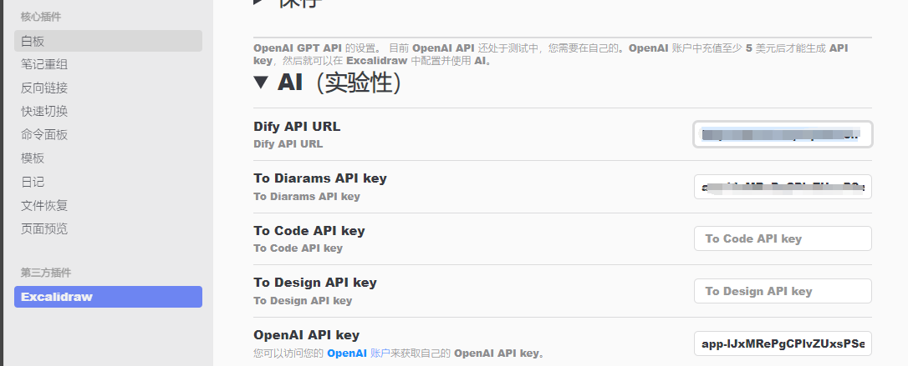
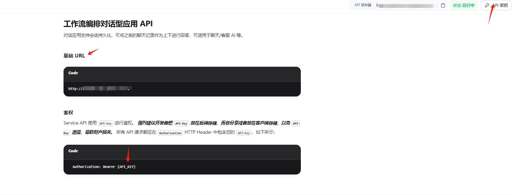
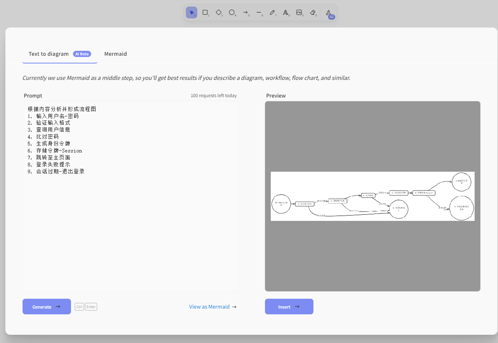
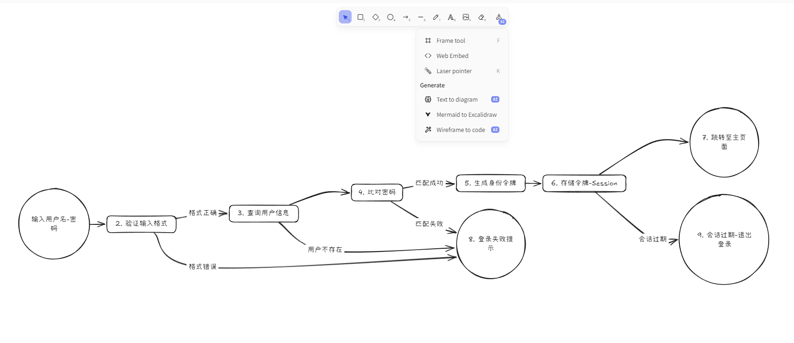

# Obsidian-excalidraw-ai-dify-plugin

AI functionality can be implemented using the DifyAPI.

[中文](./README_CN.md)
[RAW README](./README-RAW.md)


## Packaging
1. Node.js >18
2. Run `yarn install`
3. Run `yarn build`
4. Install the `Excalidraw` plugin in Obsidian
5. Copy the files from the `dist/*` directory and replace the corresponding files in the plugin directory `.obsidian\plugins\obsidian-excalidraw-plugin\`
6. Restart Obsidian

## Configuration
1. Open Obsidian settings, and you will see DifyAPIURL and other options:
   - **DifyAPIURL**: The API URL of Dify, can be a locally deployed address.
   - **ToDiaramsAPIKey**: The token for configuring the workflow that converts to Mermaid.
   - **ToCodeAPIKey**: The token for configuring the workflow that converts to code (reserved, feature not implemented).
   - **ToDesignAPIKey**: The token for configuring the workflow that converts to design (reserved, feature not implemented).


2. In Dify, configure a simple workflow, choose a suitable model, and input a system prompt, such as: "Return only content in Mermaid-supported format, without any additional content."


3. Then, click "Access API" in Dify to see the base URL, which is the DifyAPIURL, but without the "v1" part. Set the API key to obtain the **ToDiaramsAPIKey**.


## Usage
Click the **AI-Text to Diagram** feature and start using it!





- Example:
```
Analyze the content and generate a flowchart:
1. Input username-password
2. Validate input format
3. Query user information
4. Compare passwords
5. Generate authentication token
6. Store token-Session
7. Redirect to main page
8. Login failure message
9. Session expired-logout
```