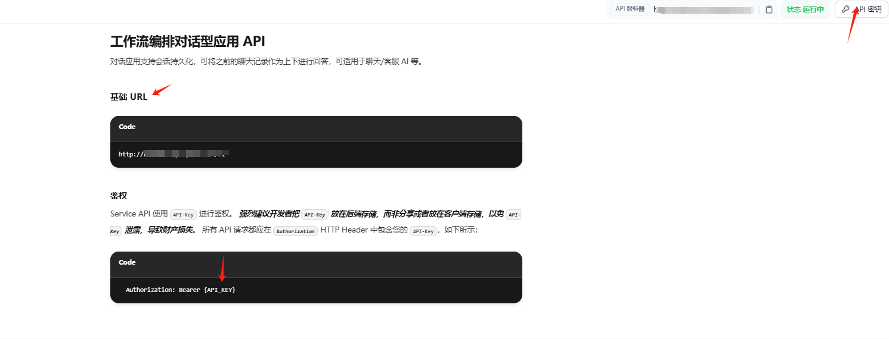
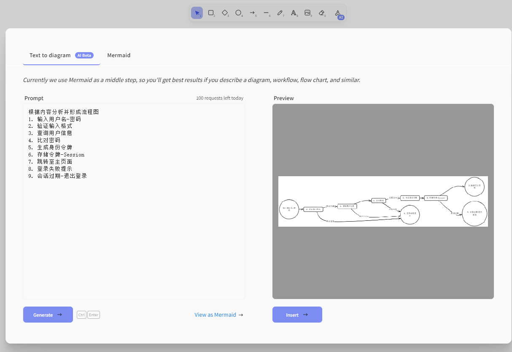

# Obsidian-excalidraw-ai-dify-plugin

可以使用DifyAPI来实现AI功能

[原README](./README-RAW.md)

## 打包
1. node >18
2. yarn install 
3. yarn build
4. Obsidian安装插件 `Excalidraw`
5. 将打包后dist/* 下文件, 拷贝替换插件目录下的文件 `.obsidian\plugins\obsidian-excalidraw-plugin\`
6. 重启Obsidian

## 配置
1. 打开Obsidian设置, 可以看到 DifyAPIURL 和 其他几个选项
- DifyAPIURL: dify api地址, 可以是本地部署的地址
- ToDiaramsAPIKey: 就是配置转换为Mermaid的工作流的token
- ToCodeAPIKey: 就是配置转换为代码的工作流的token (预留,未实现功能)
- ToDesignAPIKey: 就是配置转换为设计类的工作流的token (预留,未实现功能)


2. Dify中配置简单的工作流，选择觉得合适的模型, 输入System提示词, 比如: "仅返回Mermaid支持的格式内容，不要包含任何其他内容"


3. 之后, 点击Dify中的访问API, 可以看到基础URL, 就是DifyAPIURL, 但是要去掉"v1";  设置API密钥, 就得到了 ToDiaramsAPIKey



## 使用
点击 AI-Text to diagram功能, 愉快的使用吧

- 示例: 
```
根据内容分析并形成流程图
1. 输入用户名-密码
2. 验证输入格式
3. 查询用户信息
4. 比对密码
5. 生成身份令牌
6. 存储令牌-Session
7. 跳转至主页面
8. 登录失败提示
9. 会话过期-退出登录
```





